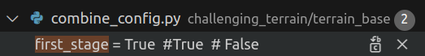
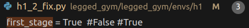

# [TELEAI ICCV-CHALLENGE](https://human-robot-scene.github.io/Terrain-Challenge/)


### Installation ###
```bash
Refer to README.md
```

### Usage ###
`cd legged_gym/scripts`
1. Train first-stage base policy:  
DO set the first-stage in the repo to True


```
python train.py --exptid h1_2_first_stage_xxxxxxx --device cuda:0 --num_envs=4096 --task h1_2_fix --no_wandb --headless
```

2. Training second-stage resume policy for terrains:

   Do set the first-stage to False
```
python train.py --exptid h1_2_fix_second_stage --device cuda:0 --num_envs=4096 --task h1_2_fix --no_wandb --resume --resumeid=h1_2_first_stage_xxxxxxx --headless
```
